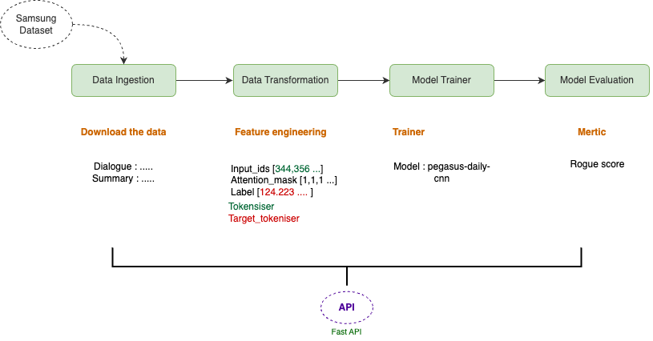

# 📌 NLP End-to-End Project - Pegasus for Text Summarization  

Ce projet est une implémentation complète d’un pipeline NLP basé sur le modèle **Pegasus (CNN/DailyMail)** pour la génération automatique de résumés de texte. Il comprend la collecte et la transformation des données, l'entraînement du modèle, ainsi que la mise à disposition d'une API pour la prédiction.  

<p align="center">
  
</p>

## 📂 Structure du projet  

### 🔹 1. Configuration  
- **Config.yaml & Params.yaml** : Contiennent les hyperparamètres et les chemins de fichiers pour éviter de modifier directement le code.  
- **Configuration Manager** : Une classe Python qui facilite le chargement des configurations et la gestion des composants du projet.  

### 🔹 2. Data Ingestion  
- Télécharge et extrait le **Samsung dataset**, qui contient des dialogues et leurs résumés.  
- Stocke les données brutes sous un format exploitable pour la transformation.  

### 🔹 3. Data Transformation  
- Prépare les données pour l'entraînement en appliquant la tokenisation avec **Pegasus tokenizer**.  
- Convertit les dialogues et résumés en **input_ids, attention_mask et labels** utilisables par le modèle.  

### 🔹 4. Model Trainer  
- Entraîne **Pegasus (CNN/DailyMail)** avec les données transformées.  
- Utilise `DataLoader` pour créer des batchs et accélérer le processus d’apprentissage.  
- Applique une fonction de perte adaptée aux tâches de résumé.  

### 🔹 5. Model Evaluation  
- Évalue les performances du modèle à l’aide du **ROUGE score** (Recall-Oriented Understudy for Gisting Evaluation).  
- Cette métrique compare le résumé généré avec la version de référence en mesurant la similarité des n-grams.  

### 🔹 6. API avec FastAPI  
- Permet d’exposer le modèle sous forme d’API pour interagir avec des applications externes.  
- Différents endpoints :  
  - **Training API** : Lance un nouvel entraînement du modèle.  
  - **Prediction API** : Génère un résumé pour un texte donné.  
  - **Batch Prediction API** : Traite plusieurs textes en une seule requête.  

## 🚀 Installation & Exécution  

1. **Cloner le repo**  
   ```bash
   git clone <repo-url>
   cd <repo-folder>
   ```

2. **Installer les dépendances**  
   ```bash
   pip install -r requirements.txt
   ```

3. **Lancer l’API**  
   ```bash
   uvicorn app:app --reload
   ```

## 📊 Évaluation  

Le modèle est évalué avec le **ROUGE score**, une métrique largement utilisée en résumé automatique. Elle compare le texte généré avec une référence en mesurant le taux de recouvrement des mots et phrases. Plus le score est élevé, plus le résumé est fidèle.  

## 📌 Technologies utilisées  

- `Transformers` (Hugging Face) → Modèle Pegasus  
- `PyTorch` → Entraînement et gestion du modèle  
- `FastAPI` → Création de l’API  
- `nimpy, Pandas` → Manipulation des données  
- `ROUGE Score` → Évaluation des résumés  


### Workflows 

1. Config.yaml
2. Params.yaml
3. Config entity
4. Configuration Manager
5. Update the components- Data Ingestion,Data Transformation, Model Trainer
6. Create our Pipeline-- Training Pipeline,PRediction Pipeline
7. Front end-- Api's, Training APi's, Batch Prtediction API's
